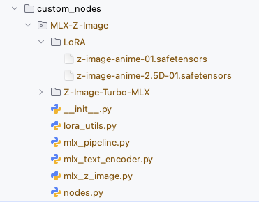

## ComfyUI Custom Node Setup


-----
### Node + Performance


-----

## Project Structure


```text
custom_nodes/
    MLX_z-image/
    ├── LoRA/                          # Add LoRa files to this dir
    ├── Z-Image-Turbo-MLX/             # MLX Weights 
    ├── mlx_text_encoder.py            # MLX converted Text Encoder
    ├── mlx_z_image.py                 # MLX converted transformer
    ├── mlx_pipeline.py                # mlx Pipeline
    ├── __init__.py                    
    ├── nodes.py                       # Add node
    └── lora_utils.py                  # LoRA Adaption
````

-----



-----


## TODO

  - [ ] **Multiple LoRA**: Able to apply mutiple LoRA to node.
